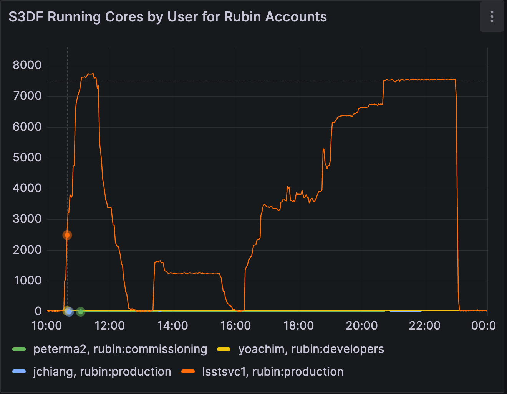
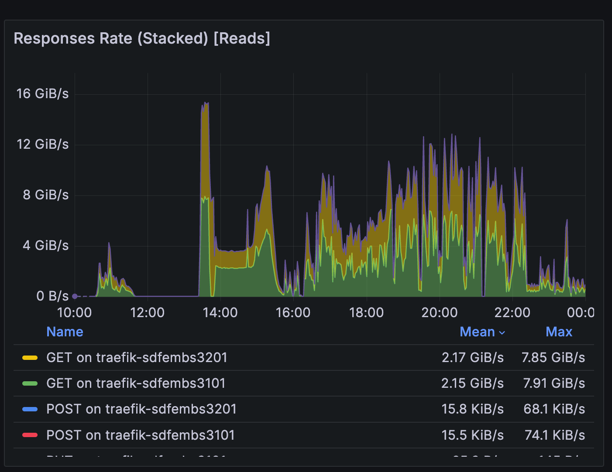
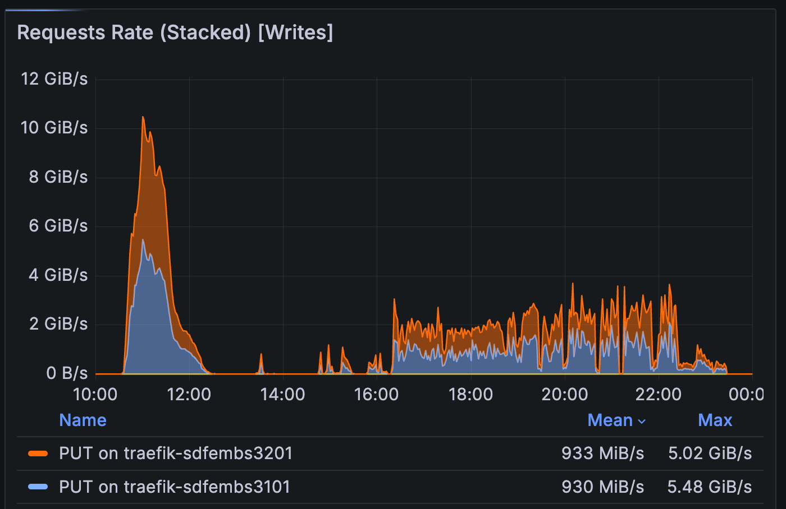
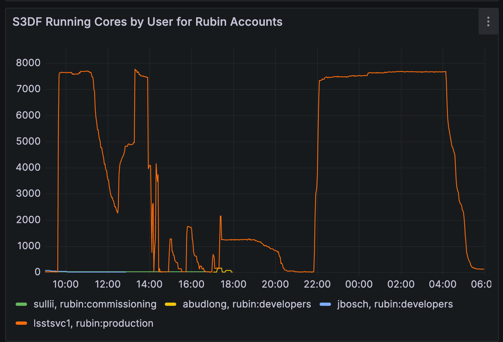
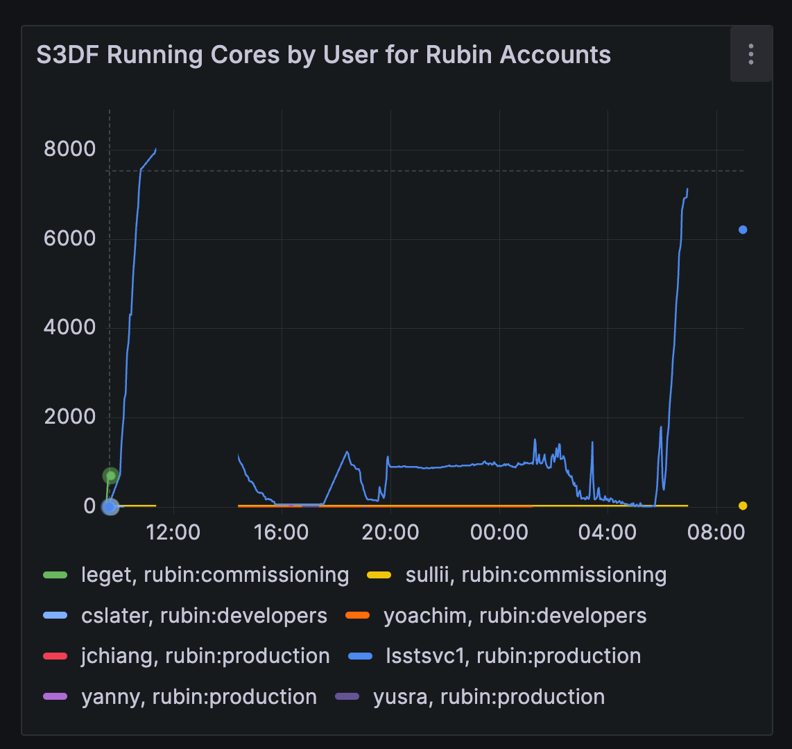
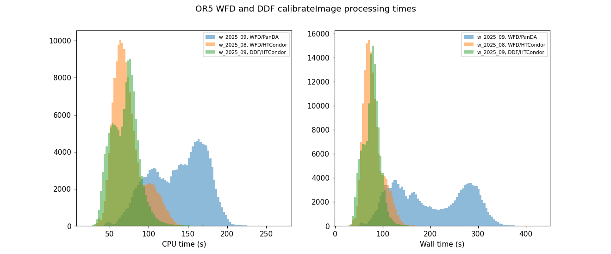
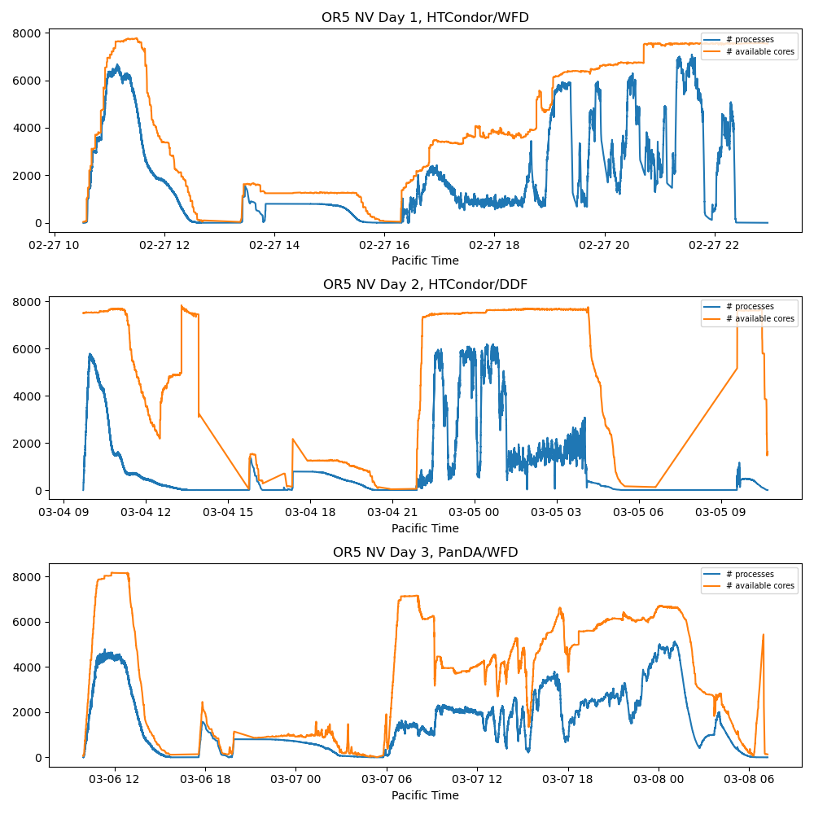
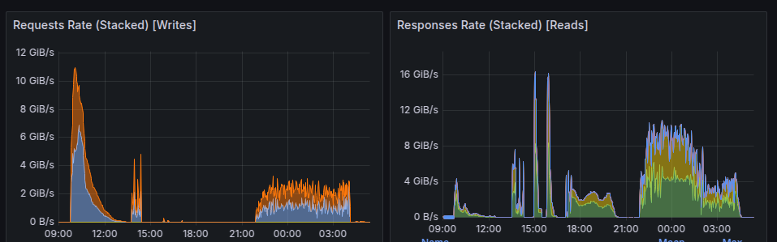
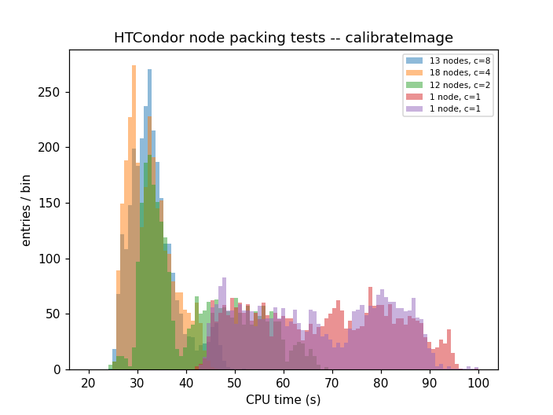

# Report from Operations Rehearsal 5

```{abstract}
Report from Operations Rehearsal 5 as of March 11 2025. 

There was another round of tests week of April 7th 20245, which will be incorporated soon
```

## Introduction

The LSSTCam is nearly in place, and when it starts producing data, it won’t trickle — it’ll blast. The question we set out to answer during **Operations Rehearsal 5 (OR5)** was:

> **Can Rubin Data Management (DM) keep up with LSSTCam-scale data processing?**


By LSSTCam-scale, we mean:

- **800 visits per night**, each visit composed of **189 detectors**;
- Processing that includes both:
  - **DRP-style batch processing**, and
  - **Prompt Processing (AP)** at the US Data Facility (USDF).

### Goals of OR5

- **Batch**: Demonstrate processing of 800 visits in 24 hours using the Nightly Validation pipeline (coadds, no DIA).
- **Prompt**: Demonstrate prompt processing at design cadence (~37 seconds per image) using replayed simulated images.

This rehearsal was conducted entirely within DM at the **USDF**, with no summit component.
The load was applied to many layers of infrastructure simultaneously and includes, but is not limited to:
- **embargo rack**: storage and network
- **/sdf/group (weka)**: shared software stack  
- **batch nodes**: 72 Milanos (120 cores each)  
- **Kubernetes** Embargo nodes (d-nodes)
- **PostgreSQL**: for the Butler registry
- **Cassandra**: for APDB
- **Kafka**: for nextVisit events and for alert distribution

The capability to meet these challenges depends on the full **DM stack**.
Representatives from campaign management, pipelines, middleware, and the data facility (S3DF) participated, monitored, and troubleshooted throughout OR5.

### Experiment Setup

We prioritized **successful execution** over strict experimental design.
Fixes discovered on one day were immediately applied to subsequent tests.
This approach enabled rapid progress, but it means:

- Comparisons across days (e.g., **HTCondor vs PanDA**, **w_2025_08 vs w_2025_09**) are **not controlled experiments**.
- The data is valuable for operational insight, but not suitable for rigorous benchmarking.

To generate load, we copied **10 days of LSSTCam-imSim data** (DESC DC2 Run2.2i) into the embargo rack:

- **7 days of Wide-Fast-Deep (WFD)**
- **3 days of Deep Drilling Field (DDF)**

We ingested this into the butler repo,`embargo_or5`, ignoring timestamps: the first 800 visits were treated as day one, the next 800 as day two, and so on.
Since commissioning data resembles DDF in cadence, we consider DDF more representative of near-term operational expectations.

All logs and issues are documented:

- [Execution Log and Stand-up Notes](https://rubinobs.atlassian.net/wiki/spaces/DM/pages/518455334)
- [Identified Issues Table](https://rubinobs.atlassian.net/wiki/spaces/DM/pages/524189767)

Discussion and real-time debugging were captured in the `#ops-rehearsals` Slack channel.


## Batch Processing

### Setup

We conducted three one-day batch processing tests during OR5:

| Day | Date      |  WMS      | Pipeline     | Dataset | Pilot Team     |
|-----|-----------|-----------|--------------|---------|----------------|
| 1   | Feb 27    | HTCondor  | w_2025_08    | WFD     | Homer & JimC   |
| 2   | March 4   | HTCondor  | w_2025_09    | DDF     | Homer & JimC   |
| 3   | March 6   | PanDA     | w_2025_09    | WFD     | Yusra & JimC   |

The original goal was to span a 2×2 test matrix:
- Workflow management system: **HTCondor** vs **PanDA**
- Dataset type: **Wide-Fast-Deep (WFD)** vs **Deep Drilling Field (DDF)**

However, we prioritized **successful execution** over strict matrix coverage.
That means not all combinations were tested exactly once, and some experimental conditions changed between runs.


### Batch Test 1: WFD, `w_2025_08`, HTCondor

**Configuration:**

- **Dataset**: `2.2i/raw/OR5/WFD/day1/DM-48585`
- **Pipeline version**: `w_2025_08`  
- **Workflow manager**: HTCondor
- **submit_dir**: `/sdf/group/rubin/shared/campaigns/LSSTCam-imSim-OR5-htcondor/submit/LSSTCam-imSim/OR5/runs/nightlyValidation_day1/w_2025_08/DM-4917`


We ran 800 visits of WFD-mode data through the **Nightly Validation** pipeline using **HTCondor** and **w_2025_08**. The software stack was mounted via **CVMFS**, and Butler's caching behavior was customized to reduce pressure on the embargo rack:
- Normally,we configure the Butler to use a 500-dataset cap for local cache.
- We increased this to **1 TB**, allowing local re-use of calibration data across jobs.

This tuning was motivated by known I/O bottlenecks during **instrument signature removal (ISR)**. ISR requires multiple calibration frames per detector (bias, dark, flat, etc.), resulting in substantial read load from the embargo rack.

To mitigate this, we experimented with **detector-level clustering** via BPS. This strategy, which groups quanta by detector ID, sends each detector’s jobs to a single node, thus reducing redundant reads.
However, as of February 29, naively clustering by detector caps the number of parallel jobs at **189** — far below the 8,000+ cores available. To scale up:

- The 800 visits were divided into **53 groups**, each covering ~15 visits.
- Each group was submitted as a separate BPS submission.
- Within each group, clustering by detector was applied.

This approach maintained the locality benefits while increasing total concurrency via parallel submissions.

#### Observations




Figure 11 shows the progression through the pipeline stages, as seen in CPU usage:

- **Step 1**: Near-saturation of available cores. ISR and early steps were well parallelized, and cluster utilization approached the ~8,000 core ceiling. 
- **Step 2**: Underutilization (~800 concurrent jobs) due to `finalizeCharacterization` being parallelized by visit instead of detector. This was addressed in [DM-48932](https://rubinobs.atlassian.net/browse/DM-48932).
- **Step 3**: Significant idle time due to short-duration `makeDirectWarp` and `makePsfMatchedWarp` tasks being scheduled independently. These were later re-clustered, as described in [DM-49246](https://rubinobs.atlassian.net/browse/DM-49246).
- **Plateau phase**: Slurm failed to preempt low-priority jobs, limiting throughput. Manual intervention was required (see [DM-49356](https://rubinobs.atlassian.net/browse/DM-49356)).
- **Final drop**: A complete shutdown due to the HTCondor database reaching its 25 GB partition limit. This was fixed the following day by moving it to a larger volume ([DM-49296](https://rubinobs.atlassian.net/browse/DM-49296)).

**I/O Behavior**:

  


- Read throughput was high but stable. The per-detector clustering approach (53 groups × ~15 visits) successfully filled the cluster while improving cache locality, minimizing embargo rack reads during ISR.
- A notable spike occurred during `ConsolidateVisitSummaryTask`, with read rates exceeding previous observations. This prompted an investigation into more efficient metadata access, tracked in [DM-49314](https://rubinobs.atlassian.net/browse/DM-49314).
- Write patterns during coaddition matched expectations for I/O-intensive stages.

**Additional Observations**: During the test, **AuxTel was observing**, and calibration frames were being transferred and ingested to the embargo rack.
In the past, this dual load caused ingest problems—but in this test, **AuxTel ingest operated normally**.
The successful ingest alongside active science processing suggests that the embargo rack and I/O infrastructure can now sustain concurrent operational loads, with the caveat that LATISS data is only one detector and this may not hold for LSSTCam. 


This test demonstrated that:

- Detector-level clustering is an effective strategy for ISR-heavy stages.
- Several bottlenecks (graph generation, scheduling, step parallelism) have clear mitigation paths.

### Batch Test 2: HTCondor, DDF

**Configuration:**

- **Dataset**: `2.2i/raw/OR5/DDF/day1/DM-48585`
- **submit_dir**: `/sdf/group/rubin/shared/campaigns/LSSTCam-imSim-OR5-htcondor-newday/submit/LSSTCam-imSim/OR5/runs/nightlyValidation2_day1/w_2025_09/DM-49179`  
- **Pipeline version**: `w_2025_09`  
- **Workflow manager**: HTCondor  
- **Submission details**: 
  - Allocated 8,000 cores at the start  
  - `--auto` resource allocation from that point onward  
  - BPS submissions: 53 groups, 20 seconds between submissions (down from 50s on Day 1)  
  - Step 3 split into 20-patch groups to avoid quantum graph (QG) memory errors  


#### Observations



- **Step 1 took significantly longer** than Day 1, despite reduced submission spacing.
  - This was partly due to pipeline errors triggered by **insufficient refcat coverage** in the DDF region.
  - The failures led to **retries**, reducing concurrency and extending runtime.
- As Step 1 was wrapping up, **unexpected load appeared** on the cluster. 
  - It was traced to an unmonitored **PanDA dev instance** that began launching jobs mid-test.
  - USDF staff attempted to cancel them using `scancel`, but PanDA’s persistent retry mechanism continually respawned jobs.
  - Ultimately, direct cancellation by the PanDA devs who launched the jobs was required to stop the runaway job spawning. 
- Node `sdfmilan093` was manually drained due to persistent Weka-related issues

**Takeaways**

- **Step 1 runtime doubled** due to a combination of pipeline retries and reduced concurrency.
- The **PanDA runaway job scenario** revealed a gap in local operational control:
  - USDF staff lacked a reliable way to **terminate PanDA job submission** from external controllers.
  - Highlighted the need for stronger coordination and job kill capabilities for future rehearsals.
- Monitoring data confirmed **fewer concurrent jobs** than Day 1, contributing to slower throughput. The **PanDA runaway job scenario** revealed a gap in local operational control
- QG out of memory failures mitigated on [DM-49296](https://rubinobs.atlassian.net/browse/DM-49296)

### Batch Test 3: PanDA, WFD

**Configuration:**

- **Dataset**: `2.2i/raw/OR5/DDF/day1/DM-48585`
- **submit_dir**: `/sdf/group/rubin/shared/campaigns/LSSTCam-imSim-OR5-PanDA/DDF_day1` 
- **Pipeline version**: `w_2025_09`  
- **Workflow manager**: PanDA   
- **submission details**:
  - Step 1: 20s between BPS submissions  


#### Observations



- This run included the addition of `pipetask report`, which had been missing from the previous two tests. It took much too long to block the submission of the next processing stage. 
- **InfluxDB issues** led to **gaps in monitoring data**, but three distinct processing phases are still visible.
- All steps took **~3× longer** than in the earlier HTCondor runs, a discrepancy visible in both **wall time** and **CPU time**.
- **One Step 3 group failed to submit** (1 out of 10), which underscores the need for consistent campaign maangement tooling.



- **CPU runtime was significantly inflated** on Day 3 compared to the same tasks in Batch Test 1.
- **Actual core usage** was also low relative to available capacity, suggesting inefficiencies in how PanDA-managed jobs were scheduled and executed.

  


- These figures compare the number of concurrent `pipetask` processes (from task metadata) with available Slurm cores.
- Across all NV runs, efficiency was well below 100%. On Day 3, the gap between allocated and actively used cores was especially stark. Some drops are temporally correlated with network traffic spikes to and from the embargo rack, suggesting shared resource contention.


#### Performance Investigation

An **investigation* is ongoing, but several key factors have been identified:

- **Monitoring limitations**: It's currently difficult to observe actual core utilization (vs allocations) in real time. Improving this has been a long-standing need. OpenSearch is partially in place, but full integration is pending.
- **Node packing effects**: Tests showed that tightly packing nodes—up to the full 120-core capacity—resulted in the same ~3× slowdown, even with HTCondor.  
- **I/O contention**: `pipetask report` jobs failed to finish, potentially due to I/O pressure on the scratch area.

Emerging evidence suggests the PanDA slowdown may stem from unintended **CPU pinning and L3 cache contention**:

- **PanDA jobs are pinned** to specific cores (as if `srun --cpu-bind=cores` were used), which clusters them onto single NUMA modules.
- **AMD Milan processors** have 8 cores per NUMA module, which aligns poorly with PanDA's 8-jobs-per-pilot submission model.
- When pinned, **multiple memory-intensive tasks** (e.g., `calibrateImage`, `finalizeCharacterization`) compete for the same **L3 cache**, causing significant slowdowns due to cache misses.

Without CPU pinning, the system scheduler could redistribute load across NUMA boundaries, reducing contention.



- This figure shows that forcing jobs to fully occupy a node with CPU pinning results in **2–3× longer runtimes**, consistent with the behavior observed during Batch Test 3.

---

#### Takeaways

- **PanDA performance was significantly worse** than HTCondor under OR5 test conditions, but may be recoverable with tuning.
- **Avoiding CPU pinning**, and potentially under-packing nodes, could substantially improve throughput.
- **Better visibility into actual resource usage** (vs allocations) is urgently needed.
- The ability to **monitor and control core-level behavior** is essential for tuning and diagnosing end-to-end system performance.

This test illustrates why integrated, realistic rehearsals are essential: they reveal subtle yet impactful performance pathologies that wouldn't emerge from unit or subsystem testing alone.


### Batch Test Takeaways as of March

The batch tests in OR5 demonstrated that Rubin’s data processing system can approach LSSTCam-scale throughput, but several bottlenecks and unresolved issues must be addressed before on-sky operations:

- **Quantum Graph (QG) Generation Gaps**  
  Gaps between pipeline stages due to slow or memory-intensive QG generation limited end-to-end throughput. Improvements in QG efficiency (e.g., step co-launching, graph splitting strategies) are essential.  
  _See: [DM-49296](https://rubinobs.atlassian.net/browse/DM-49296)_

- **Step Parallelism Constraints**  
  Some tasks (e.g., `finalizeCharacterization`) were originally parallelized by visit, limiting concurrency. Refactoring to support per-detector execution restored full cluster utilization.  
  _See: [DM-48932](https://rubinobs.atlassian.net/browse/DM-48932)_

- **Short-Running Tasks and Scheduling Inefficiency**  
  Unclustered warp tasks were too lightweight to schedule efficiently. Re-grouping them resolved this for HTCondor; similar clustering logic is needed in PanDA.  
  _See: [DM-49246](https://rubinobs.atlassian.net/browse/DM-49246)_

- **Preemptable Job Handling**  
  Slurm failed to cancel preemptable jobs in real time, artificially capping core availability. This required manual intervention and highlights the need for improved job control logic.  
  _See: [DM-49356](https://rubinobs.atlassian.net/browse/DM-49356)_

- **Monitoring Gaps**  
  We lack reliable, real-time visibility into actual core usage (vs allocations), making it difficult to diagnose underutilization or oversubscription. Scaling OpenSearch and improving job-level observability is a high priority.

- **Infrastructure Configuration Limits**  
  Failures due to undersized HTCondor DB partitions and pipetask scratch I/O contention were resolved during the test but underscore the need for hardened configuration across all components.

- **PanDA Runtime Slowdown**  
  Jobs under PanDA ran 2–3× slower than equivalent HTCondor jobs. Emerging evidence points to CPU pinning and L3 cache contention due to poor NUMA alignment. These effects must be mitigated before full PanDA deployment.  
  _See: [Figure 30](figures/fig30.png)_


**In summary:**  
The batch processing system is fundamentally capable, but **scheduler behavior, task configuration, infrastructure tuning, and monitoring gaps** must be addressed to ensure we can sustain DRP throughput at LSSTCam scale once real data starts flowing.


## Prompt Processing

### Setup

#### Data Configuration

The prompt processing tests replayed the 800 exposures from the collection:

- `embargo_or5/2.2i/raw/OR5/DDF/day2/DM-48585`

We intended to use distinct original exposures each day, but pracitcally repeated some visits during OR5. While this had no known impact on internal pipeline behavior, it was later flagged by alert brokers as problematic. In OR5.2, we ensured **exposure uniqueness** via overwriting their exposure timestamps to avoid confusing downstream consumers.

Replay was driven by a custom Python script that injected one exposure every **32 seconds**, approximating the LSSTCam design cadence (30-second exposures plus overhead).

To support this, for OR5:

- Each replayed exposure was assigned a **new, unique exposure ID**
- The original `visitInfo` was preserved to ensure valid calibration associations during OR5.
- A new `day_obs` was assigned based on the replay time, resulting in some inconsistency between `exposure timespan` and `day_obs` metadata — this was noted but had no observed operational impact

For OR5.2:
- Instead of preserving the original `visitInfo`, we updated it using the replay time.
- The mocked nextVisit events have consistent timestamps.

The full **AP pipeline (ApPipe)** was run, using:

- **Cassandra APDB**
- **Kafka** for alert distribution (alerts were published to the `alerts-simulated` topic)

#### Infrastructure Configuration

OR5 marked the first time prompt processing scaled to this level using production-adjacent infrastructure:

- **Embargo Kubernetes nodes** (March):
  - 28 nodes
  - 48 cores / 256 GB RAM / 550 GB ephemeral storage each
  - Dedicated to prompt processing during OR5, though this exclusivity will not persist in commissioning
- **Embargo storage**:
  - Previously reserved for summit data
  - Separate buckets provisioned for OR5
  - File notifications triggered auto-ingest and presence microservices, closely mimicking operational behavior

The system exercised both supported backend platforms at OR5:

- **Knative**
- **KEDA**

This was the first time either backend had been run at this scale for real-time prompt processing workloads.

#### Execution Plan

| Day          | Stack Version           | Pipeline Version | Platform Order        |
|--------------|-------------------------|------------------|------------------------|
| March 3, 2025 | Prompt Service 5.1.1, `d_2025_02_17` | `w_2025_09`      | Knative → KEDA         |
| March 5, 2025 | Prompt Service 6.0.0, `d_2025_03_01` | `w_2025_09`      | KEDA → Knative         |

Each day replayed 400 visits using each platform, for a total of **800 visits per day**, and **1,600 prompt runs overall**.


### Prompt Test 1

**Date:** March 3, 2025  
**Stack version:** Prompt Service 5.1.1 (`d_2025_02_17`)  
**Pipeline version:** `w_2025_09`  
**Platforms tested:** Knative → KEDA  
**Visits replayed per platform:** 400 (total 800)


The first day of prompt processing was marked by a series of confusing and overlapping system failures. Upon closer investigation, most of the critical issues traced back to the **PostgreSQL Butler registry**, which became intermittently incapacitated under load.

#### Observations

- **Registry Failures**: Multiple errors with varied symptoms were ultimately traced to **Postgres-related slowdowns** in dataset transfer from the prompt workers back to the central repository. This occurred **after processing was complete**, but still within the execution lifecycle.
- **Worker Caps**: Scaling plateaued well below expected levels:
  - **Knative** capped at ~1,000 concurrent workers
  - **KEDA** capped at ~1,300
  This behavior was consistent across retries and may be linked to database or eventing constraints.
- **APDB Timeouts**: Under stress, the Cassandra-based APDB experienced timeouts, likely a knock-on effect from the Butler registry and I/O contention.
- **Secondary Issues**:
  - Driver script bugs
  - Ghost requests
  - Transient pipeline errors
  - Monitoring gaps
  - A rare race condition in startup


Due to the number and variety of failures, Day 2 testing was postponed to give teams time to:

- Diagnose registry and APDB behavior under concurrent access
- Address bugs and misconfigurations in the driver and orchestration stack
- Implement scalable fixes to reduce contention

**PostgreSQL resources were significantly increased** in response, including CPU/memory and storage backend tuning.


This test highlighted the importance of **end-to-end orchestration robustness**, not just pipeline correctness. Even when processing succeeds at the task level, performance can collapse if product registration, dataset transfer, or metadata handling stalls downstream components.


### Prompt Test 2

**Date:** March 5, 2025  
**Stack version:** Prompt Service 6.0.0 (`d_2025_03_01`)  
**Pipeline version:** `w_2025_09`  
**Platforms tested:** KEDA → Knative  
**Visits replayed per platform:** 400 (total 800)


Day 2 of prompt processing was more structured and targeted. A **new release (rubin-dev 10)** was available, and the team established a **control group** to compare changes systematically.


#### Observations

- **Middleware speed-up tests**:  
  Two proposed improvements to speed up dataset export were tested. **Neither provided sufficient performance gains**, confirming that the dataset export bottleneck remains unresolved.

- **Knative worker cap**
  The team tested Knative's ability to exceed its known concurrency cap by assigning **2 workers per pod**.  
  Result: the platform **still capped at ~1,000 workers**, indicating a broader systemic limitation.

- **"No export" control test**:  
  By **disabling dataset export** from workers to the central Butler repository, the team was able to:
  - Confirm that **export was the primary bottleneck**
  - Observe that **pipeline execution and alert generation functioned smoothly**
  - Identify **memory availability** as the only remaining scaling constraint (capped at ~1,500 workers with OR5 resources)

- **Quick Stack workflow exercised**:  
  The team deployed a custom-built stack with ticket branches, bypassing the formal release process.  
  This “quick stack” path worked well and is expected to be critical for commissioning scenarios requiring rapid patch testing. A few integration issues were identified and documented.


### Takeaways

This test **confirmed the dataset export system as the principal performance limiter** at LSSTCam scale. With export disabled, the pipeline stack scaled well and ran reliably. The Knative worker cap remains under investigation, and KEDA may be favored for future high-concurrency tests. Memory availability currently defines the upper bound on parallelism.

OR5 marked the first time the prompt processing system was tested at LSSTCam scale. While core pipeline execution and alert delivery functioned as expected under load, several **scaling and infrastructure bottlenecks** were revealed that must be addressed before going on-sky.

#### Identified Issues

- **Dataset Export Bottleneck**
  - The dominant issue was a **slowdown in dataset export** from prompt workers to the central Butler repository.
  - The **PostgreSQL registry** could not sustain the metadata registration load at high concurrency.
  - Disabling export allowed the system to run smoothly, confirming this as the primary bottleneck.
  - A proposed architectural solution is documented in [DMTN-310](https://dmtn-310.lsst.io), suggesting the fix lies in **re-architecting the prompt pipeline**, not middleware tuning.

- **Knative Worker Scaling Limit**
  - Worker counts in Knative capped around **1,000**, even when deploying multiple workers per pod.
  - The root cause remains unknown, but this behavior was consistent across both prompt tests.
  - Future testing may shift emphasis toward **KEDA**, which performed better at scale.

- **Memory Constraints**
  - Scaling beyond ~1,500 concurrent workers was **limited by available memory**.
  - Oversubscription of memory prevented further horizontal scaling, especially under KEDA.
  - Expanding node memory or reducing per-worker memory footprint is necessary for future growth.

- **Middleware Speedup Attempts**
  - Two candidate middleware optimizations to improve export throughput were tested, but **neither provided sufficient gains** to unblock scaling.

- **Quick Stack Workflow Validation**
  - The “quick stack” process—used to build prompt images from local branches without a full stack release—was exercised successfully.
  - Minor issues were identified, but the workflow is expected to be critical during commissioning for rapid bug fixes and validation.

#### Path Forward

- **Redesign dataset registration flow** to eliminate bottlenecks during export (see [DMTN-310](https://dmtn-310.lsst.io))
- **Investigate and resolve the Knative scaling ceiling**; consider deprecating Knative in favor of KEDA for prompt operations
- **Expand memory capacity or optimize per-worker resource usage** to allow scaling beyond 1,500 workers
- **Continue performance testing** with additional focus on APDB behavior and full-system throughput under realistic workloads

In summary, prompt processing pipelines performed well when isolated from export overhead. However, a **reliable, scalable architecture for output registration** is essential before we can sustain LSSTCam-scale prompt operations during commissioning and survey operations.

## Conclusion

Operations Rehearsal 5 (OR5) was a clear demonstration of the iterative nature of scaling Rubin’s data processing systems: **find the bottleneck, fix the bottleneck, and test again to find the next one**.

We’re now entering the **analysis phase** of OR5 — reviewing the data, diagnosing the issues we encountered, and implementing and validating solutions. This process surfaced **unexpected bottlenecks** and we are learning where the system struggles under LSSTCam-scale loads.


Many of the bottlenecks we discovered in both **Batch** and **Prompt Processing** would **not have been identified at smaller scales**.
In DRP, we already see signs of inefficiency and underutilization — indications that more optimization and scaling work is required as we look toward Data Release 1 (DR1).
In Prompt Processing, the tests revealed **critical architectural constraints** that we must resolve to ensure stable, real-time alert generation once we’re observing.

Targeted full-scale tests that push the system to LSSTCam-scale followed by rapid iteration will continue:

- **Prompt Processing** will begin **regular scale tests**, enabling fast experimentation and continuous improvement.
- Planning is underway for **OR5 Part II**, currently scheduled for the week of **April 7**.


Every night of LSSTCam commissioning will generate valuable data — for testing both pipelines and telescope behavior.
Every issue we can solve before we go on-sky increases the likelihood that those nights will be productive and informative.

This rehearsal helped de-risk many failure modes before we’re under the pressure of real-time operations.
The more we solve now, the fewer surprises we’ll face during on-sky chaos — and the faster we’ll converge on a well-running observatory.


**Thank you to everyone who had their eyes on the processing during OR5.** 


